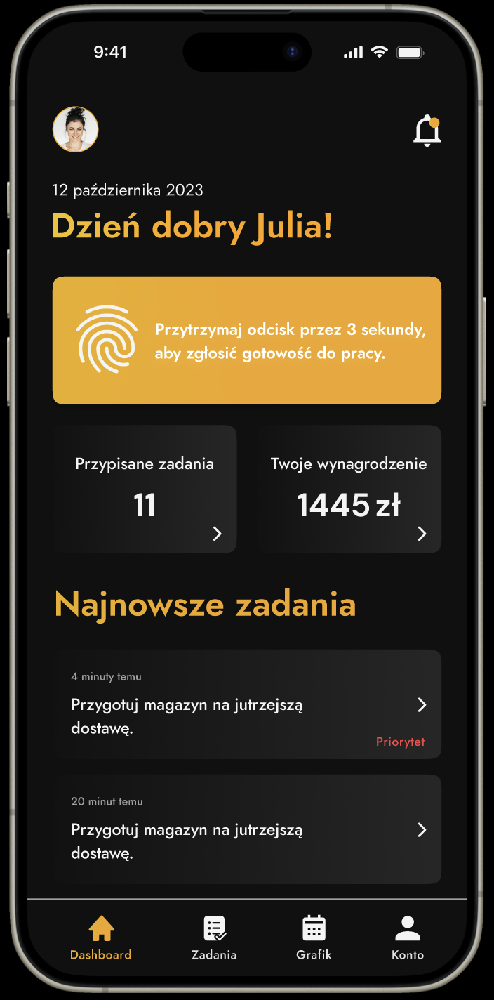
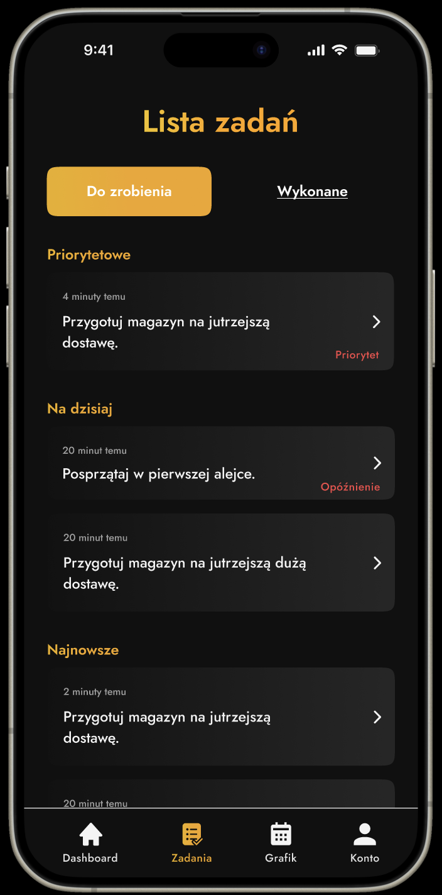
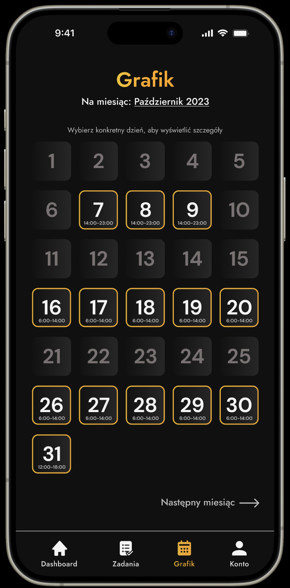
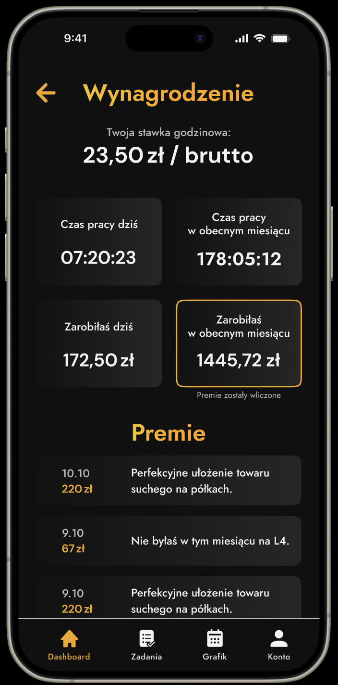

# Management App 📱

[](https://reactnative.dev/)
[](https://www.typescriptlang.org/)
[](https://redux-toolkit.js.org/)
[](https://tanstack.com/query)

Professional mobile application for business management and employee oversight, built with React Native for cross-platform compatibility.

> **⚠️ Project Status**: This project was developed between 2023-2024 but remains incomplete. Development work has been temporarily suspended.

## 🌟 Features

- **Cross-Platform**: Native performance on both iOS and Android
- **Modern Architecture**: Built with React Native 0.74.1 and TypeScript
- **State Management**: Redux Toolkit for predictable state management
- **Data Fetching**: TanStack Query for efficient server state management
- **Authentication**: JWT-based authentication with automatic token refresh
- **Offline Support**: Network status monitoring and offline capabilities
- **Secure Storage**: AsyncStorage for secure data persistence
- **Navigation**: React Navigation with bottom tab navigation
- **UI Components**: Custom reusable components with consistent design
- **Form Handling**: Robust form validation and error handling
- **Testing**: Jest for unit testing

## 🛠️ Tech Stack

- **Framework**: React Native 0.74.1
- **Language**: TypeScript 5.4.5
- **State Management**: Redux Toolkit 2.2.3, React Redux 9.1.2
- **Data Fetching**: TanStack React Query 5.34.2, Axios 1.6.8
- **Navigation**: React Navigation 6.1.17, Bottom Tabs 6.5.20
- **Storage**: AsyncStorage 1.23.1
- **Network**: NetInfo 11.3.1
- **Authentication**: JWT Decode 4.0.0
- **UI Components**: React Native Vector Icons 10.1.0, Linear Gradient 2.8.3
- **Forms**: React Native Picker Select 9.1.3
- **SVG Support**: React Native SVG 15.2.0, SVG Transformer 1.3.0
- **Testing**: Jest 29.7.0, React Test Renderer 18.3.1
- **Linting**: ESLint 9.2.0 with React Native config
- **Formatting**: Prettier 3.2.5

## 📁 Project Structure

```
├── src/                    # Source code
│   ├── assets/            # Images, icons, and static assets
│   │   ├── BonusBox/      # Bonus display component
│   │   ├── Button/        # Custom button component
│   │   ├── CalendarDay/   # Calendar day component
│   │   ├── GradientText/  # Gradient text component
│   │   ├── InfoCard/      # Information card component
│   │   ├── Input/         # Custom input component
│   │   ├── Modal/         # Modal dialog component
│   │   ├── TabButton/     # Tab button component
│   │   └── TaskCard/      # Task display card
│   ├── constants/         # Application constants
│   ├── forms/             # Form components and validation
│   │   └── Login/         # Login form
│   ├── hooks/             # Custom React hooks
│   ├── navigation/        # Navigation configuration
│   │   └── TabBar/        # Custom tab bar component
│   ├── screens/           # Application screens
│   │   ├── Account.tsx    # User account management
│   │   ├── ChangePassword.tsx # Password change screen
│   │   ├── Dashboard.tsx  # Main dashboard
│   │   ├── Salary.tsx     # Salary information
│   │   ├── SuccessChangedPassword.tsx # Success screen
│   │   ├── Tasks.tsx      # Task management
│   │   └── WorkSchedule.tsx # Work schedule
│   ├── store/             # Redux store configuration
│   │   ├── Auth/          # Authentication state
│   │   ├── Modal/         # Modal state management
│   │   └── User/          # User data state
│   ├── types/             # TypeScript type definitions
│   ├── utils/             # Utility functions
│   └── view/              # View components
├── android/               # Android-specific configuration
├── ios/                   # iOS-specific configuration
├── __tests__/             # Test files
└── public/                # Public assets
```

## 🚀 Getting Started

### Prerequisites

- Node.js 18+
- React Native CLI
- Android Studio (for Android development)
- Xcode (for iOS development, macOS only)
- CocoaPods (for iOS dependencies)

### Installation

1. **Clone the repository**

   ```bash
   git clone https://github.com/DanielSledz03/Managment-App.git
   cd Managment-App
   ```

2. **Install dependencies**

   ```bash
   npm install
   # or
   yarn install
   ```

3. **iOS Setup (macOS only)**

   ```bash
   cd ios && pod install && cd ..
   ```

4. **Start the development server**

   ```bash
   npm start
   # or
   yarn start
   ```

5. **Run on device/simulator**

   ```bash
   # For Android
   npm run android
   # or
   npx react-native run-android

   # For iOS (macOS only)
   npm run ios
   # or
   npx react-native run-ios
   ```

## 📝 Available Scripts

- `npm start` - Start React Native development server
- `npm run android` - Run application on Android device/emulator
- `npm run ios` - Run application on iOS device/simulator
- `npm test` - Run Jest tests
- `npm run lint` - Run ESLint for code quality

## 🎨 Customization

### Environment Variables

Create a `.env` file in the root directory for environment-specific configuration:

```env
# API Configuration
API_BASE_URL=your_api_base_url
API_TIMEOUT=30000

# Authentication
JWT_SECRET=your_jwt_secret
REFRESH_TOKEN_EXPIRY=7d

# App Configuration
APP_NAME=Management App
APP_VERSION=0.0.1
```

### Styling

The application uses React Native's built-in styling system. Custom styles can be added in:

- Individual component files
- Shared style constants in `src/constants/`
- Theme configuration for consistent design

## 📱 Screenshots

<div style="display: flex; justify-content: flex-start; gap: 10px; flex-wrap: wrap;">
   
   
   
   
</div>

## 🔧 Development

### Code Quality

The project uses ESLint and Prettier for code quality and formatting:

```bash
# Check for linting errors
npm run lint

# Auto-fix linting issues
npx eslint . --fix
```

### Testing

Run tests using Jest:

```bash
npm test
```

## 📄 License

This project is private and proprietary. All rights reserved.

## 📞 Contact

**Management App**

- Author: Daniel Śledź
- Repository: [Management App](https://github.com/DanielSledz03/Managment-App)

---

<div align="center">
  <p>Built with ❤️ for efficient business management</p>
  <p>Modern mobile solutions for modern businesses</p>
</div>
